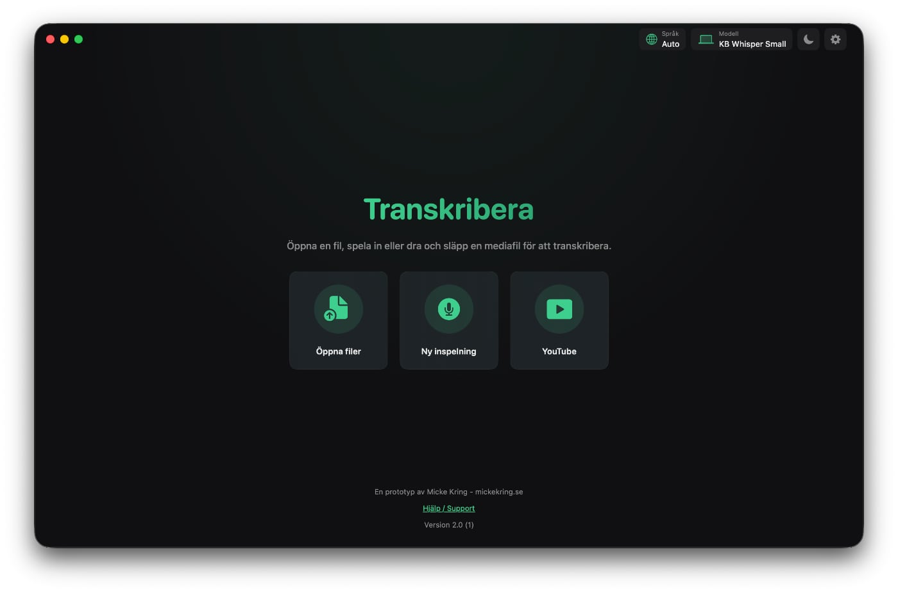
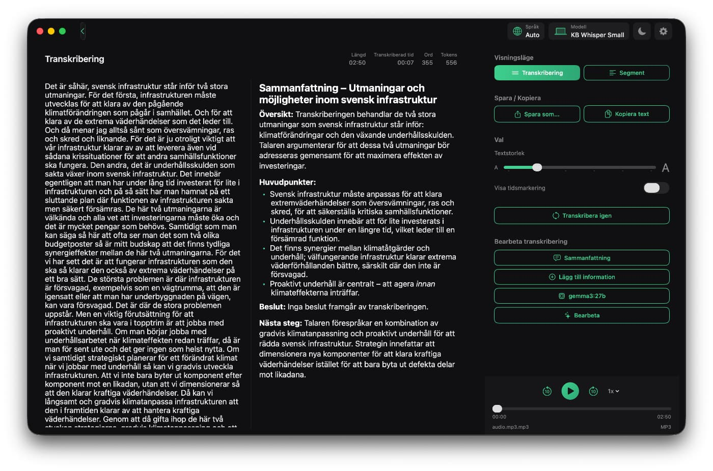

# Transcribe

A native macOS app for speech-to-text transcription. Runs entirely on-device using WhisperKit and CoreML -- no data leaves your machine unless you choose cloud transcription. Optimized for Swedish with KB Whisper models, but supports 100+ languages.






## Features

- **Local transcription** -- WhisperKit runs Whisper models on Apple Silicon via CoreML. No internet required once a model is downloaded. Supports audio files (WAV, MP3, M4A, FLAC, AAC) and video files (MP4, MOV) -- audio is extracted automatically.
- **Swedish-optimized models** -- KB Whisper models from [KBLab](https://huggingface.co/KBLab), fine-tuned for Swedish speech.
- **Built-in recording** -- Record directly in the app with live audio level metering and input device selection.
- **Text processing with LLM** -- Summarize, extract action points, or run custom prompts on transcriptions using Berget AI or a local Ollama instance.
- **Cloud transcription (optional)** -- Berget AI provides GDPR-compliant cloud transcription for when you need it.
- **Privacy by default** -- All recordings and downloads are stored in a temporary cache and automatically deleted when the app quits.
- **100+ languages** -- Whisper supports broad multilingual transcription with automatic language detection.

## Requirements

- macOS 26 (Tahoe) or later
- Apple Silicon (M1+)
- 8 GB RAM minimum (16 GB recommended for large models)

## Installation

```bash
git clone https://github.com/mickekring/Transcribe-MacOS-App.git
cd Transcribe-MacOS-App
```

### Building

There is currently an Xcode 26 beta bug where building from the Xcode UI fails with an `___llvm_profile_runtime` undefined symbol error. This is caused by `CLANG_COVERAGE_MAPPING` defaulting to YES, which adds coverage instrumentation to pure-C SPM dependencies (yyjson, a transitive dependency of WhisperKit) without linking the profiling runtime. Build from the command line instead:

```bash
xcodebuild build -scheme Transcribe CLANG_COVERAGE_MAPPING=NO
```

The default model (KB Whisper Small) downloads automatically on first launch.

## Models

**Local (on-device):**

| Model | Size | Notes |
|-------|------|-------|
| KB Whisper Base | ~150 MB | Fast, good for Swedish |
| KB Whisper Small | ~500 MB | Default. Best balance of speed and accuracy for Swedish |
| KB Whisper Medium | ~1.5 GB | Higher accuracy |
| KB Whisper Large | ~3 GB | Highest accuracy |
| OpenAI Whisper | Base--Large v3 | General multilingual models |

KB Whisper CoreML models are hosted at [mickekringai/kb-whisper-coreml](https://huggingface.co/mickekringai/kb-whisper-coreml) on Hugging Face.

**Cloud (optional):**

[Berget AI](https://berget.ai) -- Swedish cloud infrastructure, GDPR-compliant. Requires an API key configured in Settings.

## Tech Stack

- **SwiftUI** -- Native macOS interface with dark/light mode
- **[WhisperKit](https://github.com/argmaxinc/WhisperKit)** -- On-device speech recognition via CoreML
- **[YouTubeKit](https://github.com/nickkval/YouTubeKit)** -- YouTube audio downloading
- **AVFoundation / CoreAudio** -- Audio recording, playback, and device management
- **Security.framework** -- API keys stored in macOS Keychain

## Privacy and Security

- All transcription happens locally by default
- Recordings and YouTube downloads are stored in `~/Library/Caches/Transcribe/` and deleted on app quit
- Leftover files from force-quits are cleaned up on next launch
- API keys are stored in the macOS Keychain, not in plaintext
- No analytics, no tracking, no telemetry

## License

MIT License -- see [LICENSE](LICENSE) for details.

## Author

**Micke Kring** -- [mickekring.se](https://mickekring.se)

Built with [Claude Code](https://claude.ai/code).
